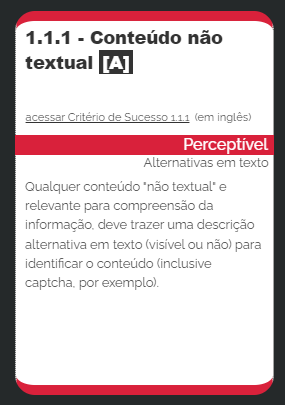
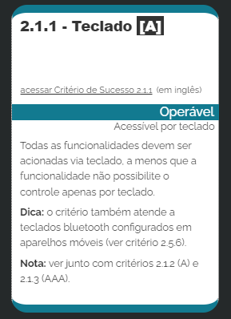
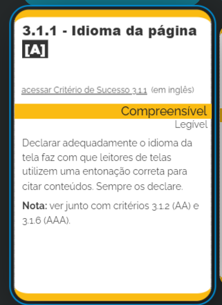
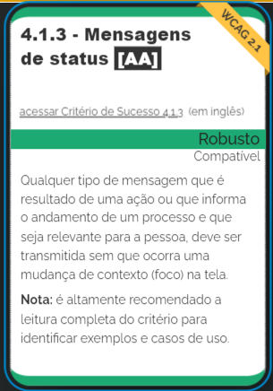

# Guia _(quase definitivo)_ de acessibilidade na web 🦯

Este não é um guia **_definitivo_**, mas podemos criar um! Então compartilhe seus conhecimentos e vamos criar o guia **_definitivo_**!

## **Tá, mas o que é acessibilidade na web de verdade?**

Acessibilidade na web não se resume a otimizar um site para leitores de tela.
\*Até você, sem alguma deficiência precisa de acessibilidade (ou melhor, você **_quer_**!)\*.

Acessibilidade é sobre criar uma web acessível a **_TODOS_**, independente se seu mouse quebrou e você só consegue navegar com o teclado (ou você simplesmente quer navegar pelo teclado), independente de deficiência ou limitação, seja ela temporária ou permanente!

> Isso significa que, mesmo que o usuário seja portador de qualquer doenças, transtornos ou deficiências de fala, visual, auditiva, cognitiva, neurológica ou física, ele deve ser capaz de entender, navegar e interagir e contribuir com a Web.
>
> Oliveira, Josheph. 2022

## **Ok, entendi. Exemplifique por-favor:**

Calma, jovem padawan. Vamos chegar nas **diretrizes da WVAG (Web Content Accessibility Guidelines)** jajá!

Temos milhares de maneiras de tornar um site mais acessível, e nem tudo (alías, quase nada) é complicado.

- Elementos de texto com um bom contraste em comparação ao seu plano de fundo. E isso implica diretamente na legibilidade
- Idioma da página especificado no HTML. Ajuda leitores de telas e navegadores em uma língua diferente da do seu site traduzirem o conteúdo automaticamente
- O texto deve ser redimensionável quando um zoom é aplicado na página pelo navegador. Podemos fazer isso especificando o tamanho dos textos em medidas relativas como o **REM**
- Navegação pelo teclado. Talvez o que mais dificulta os devs, mas relaxa, aqui no artigo vai ter umas dicas de implementação no React e com HTML puro.

## **A WCAG**

_a base fundamental para que você tenha produtos digitais verdadeiramente inclusivos e acessíveis_

WCAG são diretrizes e recomendações organizadas e mantidas pelo W3C que fundamentam a construção de conteúdos digitais com qualidade e acessíveis a qualquer pessoa independentemente de sua deficiência e/ou habilidade.

Atualmente na versão 2.1 (2018), desde a versão 2.0 (2008) foram organizadas de forma que fossem independentes de qualquer tecnologia criada e que também fossem facilmente testáveis e validadas.

### **Os princípios**

- **Perceptível**: O conteúdo deve ser **apresentável** a todos usuários, vendo ou ouvindo.
- **Operável**: A interface deve ser **navegável**, seja por texto ou voz
- **Compreensível**: A interface e o conteúdo devem ser facilmente **entendíveis** pelos usuários
- **Robusto**: O conteúdo pode ser **interpretado** por diversas tecnologias assistivas

Se algum desses princípios não for seguido usuários com deficiências **não poderão** usar a Web.

### **Critérios de sucesso**

A última versão da WCAG (2.1) possui 78 critérios de sucesso, 17 a mais que a versão anterior (2.0). A versão 3.0 irá trazer ainda mais critérios de sucesso e está prevista para chegar em 2024

Critérios de sucesso especificam o _comportamento_ esperado de uma aplicação acessível, e descrevem situações em que usuários com deficiências teriam dificuldades para navegar.

### **Níveis de sucesso**

Os critérios de sucesso estão divididos em 3 níveis, do A ao AAA. Quanto maior o nível, mais específico é o critério de sucesso e mais acessível se torna sua aplicação.

- **Nível A**: Devem ser atingidos 30 critérios específicos, que não impactam tanto o design ou a estrutura da aplicação. Pode ser o seu objetivo se você está começando a estudar sobre acessibilidade.

- Nível **AA**: Além de todos os critérios do nível A, tem mais 20 critérios de sucesso. Podem alterar o design da aplicação e sua estrutura. Em alguns países, tipos específicos de sites podem ser obrigados por lei a oferecer esse nível de acessibilidade.
  É o padrão de acessibilidade na maioria dos grandes websites

- Nível **AAA**: Além de todos os critérios do nível AA, tem mais 28 critérios de sucesso. Esse nível não é obrigatório e pode não ser possível de alcançar em alguns tipos de conteúdo.

### **Os critérios de sucesso**

Você não precisa saber todos os critérios de cor _(e você provavelmente não ia conseguir decorar todos)_, mas você pode encontrar eles em: https://www.w3.org/TR/WCAG21/.

Vamos ver um critério de sucesso em cada um dos princípios:

_além disso, vamos conhecer um site em português que pode servir de referência ao pesquisar sobre os critérios. Todas as imagens a seguir são de:_: https://guia-wcag.com/

#### **Perceptível**:



Para atingir esse critério devemos fornecer textos alternativos para todos conteúdos que não sejam textos. Você pode fazer isso usando a propriedade `alt` disponível em elementos HTML de imagens

#### **Operável**:



Esse critério beneficia, não exclusivamente, pessoas cegas que não conseguem usar mecanismos como mouse, pessoas com baixa visão que podem ter dificuldade de encontrar o cursor do mouse e também pessoas que podem possuir tremores nas mãos, dificultando o uso de mouse e, por isso, usam o teclado como meio de navegação.

Atingir esse critério pode não ser tão simples ao implementar funcionalidades como modais. Algumas das soluções ao por exemplo, implementar um modal, é trabalhar com o elemento Dialog e tentar ao máximo se manter as funcionalidades do HTML Nativo.

Outra solução mais especifica ao React é a https://www.radix-ui.com/, componentes totalmente acessíveis, sem estilos e extremamente leves. Uma ótima opção ao construir design systems acessíveis!

O proximo passo desse guia é um artigo sobre a implementação de algumas funcionalidades como modais acessíveis no React - e vai estar disponível muito em breve (confira na discussão do artigo se a proxima parte já está disponível!)

#### **Compreensível**



Declarar o idioma da página no atributo ```lang``` no HTML já nos traz o sucesso para esse critério, uma coisa interessante nessa guideline é que ela também torna o site mais acessível a pessoas que não falam a língua da sua aplicação, assim o navegador consegue automaticamente ao entrar na página recomendar uma tradução da página com o Google Tradutor.

#### **Robusto**



As vezes pode parecer obvio e talvez você até ache que sua aplicação é acessível nesse ponto, mas aqui temos uns pontos especificos para tocar:

- As mensagens de status devem ser declarativas e "user-friendly", não basta exibir um erro se você traz uma mensagem que o usuário pode não entender, como: ERRO H248. Algo como "Formato de data inválida" ou "Algo de errado aconteceu" (caso seja um erro não tratado) seria a mensagem correta.

- Não deve acontecer mudança de contexto (foco) na tela, e leitores de tela devem ler automaticamente a informação quando exibida.

## Futuro desse guia

Tenho um "roadmap" de artigos que vão ser escritos até 15/12/22 e que vão incrementar e contribuir diretamente com esse guia.

São eles:
 - Desenvolvimento de modais acessíveis no React
 - Otimizando aplicação para leitores de tela
 - Testes de acessibilidade em aplicações React

### Transformando isso no guia **definitivo** de acessibilidade no React

Esse só vai se tornar um grande guia com a ajuda da comunidade e você é essencial para isso!

Contribua com o seu conhecimento, me questione se você acha que eu falei *****, e deixei seu tabcoin se curtiu o conteúdo!

## Conclusão

Isso foi um pouco do que eu aprendi com o curso de acessibilidade no React da Rocketseat e em artigos e guias da WCAG. Todo o conteúdo desse artigo é fortemente inspirado e tem como fonte o artigo do Joseph Oliveira, instrutor do curso da Rocket.

https://www.rocketseat.com.br/ - Rocketseat
https://www.w3.org/TR/WCAG21/ - WCAG 2.1 Guidelines
https://www.w3.org/WAI/WCAG21/Understanding/ - Understanding WCAG 2.1 <br />
https://guia-wcag.com/ - Guia WCAG em português


<center>escrito com 🌶 por João "pmenta" Martins</center>